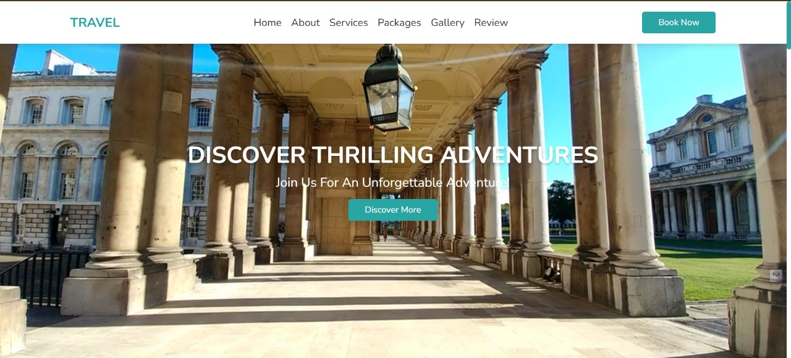

Abhishek.dev

* [Home](#home)
* [About](#about)
* [Skills](#skills)
* [Projects](#projects)
* [Timeline](#experience)
* [Contact](#contact)

Available for Roles

# Hi, I'm Abhishek Kasaudhan

## Specialized in

Building scalable web architectures, intelligent AI/ML workflows, and performance-optimized modern user experiences.

B.Tech CSE Graduate | Tech Stack Developer

[Download CV](assets/Abhishek_cv.pdf)
[Let's Talk](#contact)

## Professional Narrative

I am a Computer Science graduate passionate about engineering real-world software layers leveraging the full utility of MERN ecosystems, cross-platform React Native systems, Machine Learning frameworks, and continuous delivery cloud pipelines[cite: 9, 10, 32].

My core development philosophy hinges on translating complex technical problem statements into elegant, highly maintainable code blueprints that perform seamlessly at scale[cite: 8, 63].

## Technical Matrix

✨

### Frontend Architecture

JavaScript (ES6+)90%

React.js85%

HTML5 / CSS395%

Responsive UI/UX90%

⚡

### Backend Engineering

Node.js85%

Express.js85%

RESTful APIs90%

JWT Security80%

🗄️

### Data Layer & DevOps

MongoDB80%

SQL Databases75%

Git & GitHub90%

Postman Automation85%

🧠

### AI & Deep Learning

Python Engine80%

Scikit-Learn75%

Pandas & NumPy80%

Data Pipeline (EDA)80%

## Featured Production Suites

Mobile Cross-Platform

### FitLip Assistant

Engineered a complete mobile app workflow serving dynamic 6-day fitness tracks derived instantly from variable user profile indices[cite: 34]. Built with modular API layers[cite: 35].

* ✔ Secure tokenized route barriers via custom JWT middleware elements[cite: 35].
* ✔ Scalable Mongoose database definitions handling user properties dynamically[cite: 36].

React NativeNode.jsExpressMongoDB

Final Year System
[View Code →](https://github.com/abhishekkasaudhan45)

Full-Stack AI Production

### TripNow AI Planner

A travel planner application enabling automatic generation of responsive location travel plans and structured booking tracks[cite: 42].

* ✔ Real-time cross-network updates parsing regional weather predictions[cite: 46].
* ✔ Instant dynamic documentation conversion formatting user records directly into structured PDFs[cite: 46].

React.jsNode.jsExpressMongoDB

[Explore Live](https://abhishekkasaudhan45.github.io/Treavel-website/)
[View Source](https://github.com/abhishekkasaudhan45)

Data Science Deployment

### Smart Price Predictor

End-to-end cloud microservice analyzing residential valuation parameters[cite: 51]. Processes user property indices to output automated mathematical valuation summaries[cite: 51, 54].

* ✔ Robust exploratory statistical validation pipeline via Scikit-Learn models[cite: 52, 53].
* ✔ Deployed model parameters into lightning-fast RESTful prediction arrays[cite: 54, 55].

PythonScikit-LearnFlaskRender Cloud

Cloud Eng Deployed
[View Notebook](https://github.com/abhishekkasaudhan45)

## Education Track

2022 — 2026

### B.Tech in Computer Science & Engineering

Babu Banarsi Das University, Lucknow [cite: 57, 58]

CGPA Matrix: 7.8 / 10.0 [cite: 60]

## Accolades & Core Traits

* 🌟 Completed Data Science & AI Summer Training Matrix Suite[cite: 61].
* 🌟 Successfully engineered and cloud-hosted multiple full-stack suites[cite: 11, 55].
* 🌟 Active core builder maintaining modular, structured open documentation repositories[cite: 62].
* 🌟 Deep understanding of clean data architecture flows and modern software design patterns[cite: 29, 63].

## Initiate Connection

Your Identity (Full Name)

Digital Address (Email)

Project Scope Description

Deploy Message

### Abhishek Kasaudhan

📍 Location: Lucknow, India [cite: 6]

📧 Inbox: kasaudhan622@gmail.com [cite: 6]

📞 Phone: +91-8423459515 [cite: 6]

© 2026 Abhishek Kasaudhan | Engineered beautifully for all viewports.